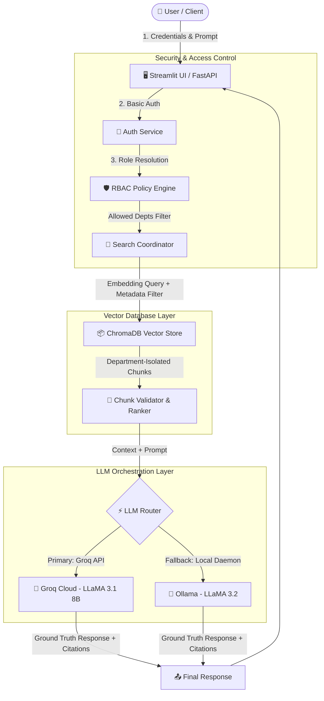

# 🛡️ GuardRAG: Enterprise RBAC-Secured Retrieval-Augmented Generation

<div align="center">

[](https://www.python.org/)
[](https://fastapi.tiangolo.com/)
[](https://streamlit.io/)
[](https://www.trychroma.com/)
[](https://groq.com/)
[](https://ollama.ai/)
[](LICENSE)

<p align="center">
  <b>A production-grade, multi-tenant enterprise knowledge retrieval assistant featuring strict Role-Based Access Control (RBAC), metadata-filtered vector retrieval, and dual-tier LLM inference with automatic offline failover.</b>
</p>

</div>

---

## 📌 Overview

Traditional enterprise RAG implementations often suffer from **data leakage vulnerabilities**—users can inadvertently extract confidential executive, payroll, or proprietary IP data simply by formulating clever prompts. 

**GuardRAG** solves this by embedding security directly into the retrieval pipeline. Using **pre-retrieval metadata filtering at the vector store layer**, queries only search embedding spaces authorized for the user's authenticated role. If an unauthorized user inquires about confidential payroll or proprietary architectures, the vector engine guarantees zero relevant chunks are surfaced to the LLM—completely eliminating unauthorized data exposure and prompt injection bypasses.

---

## 🚀 Key Features

- 🔒 **Zero-Trust RBAC Vector Filtering**: Metadata-enforced isolation at the vector database query stage (`ChromaDB`). Cross-department data leakage is mathematically prevented before LLM inference.
- ⚡ **Dual-Engine LLM Inference & Auto-Failover**:
  - **Primary**: Ultra-low latency cloud inference via **Groq Cloud** (`llama-3.1-8b-instant`).
  - **Fallback**: Privacy-first, local offline inference via **Ollama** (`llama3.2:3b`).
- 📑 **Transparent Source Provenance**: Every generated response is paired with exact source document references, department tags, and chunk indices for auditability and compliance.
- 🚫 **Anti-Hallucination & Strict Grounding**: Custom system instructions force the model to answer exclusively from retrieved context, declining unsupported queries gracefully.
- 🏢 **Multi-Department Ingestion Pipeline**: Ingests unstructured Markdown knowledge bases (Engineering, Finance, Marketing, Employee Handbooks) and structured HR records (CSV) with semantic chunk preservation.
- 🖥️ **Dual Interface Architecture**:
  - **FastAPI REST Service**: Authenticated API endpoints ready for microservice integration.
  - **Streamlit Interactive UI**: Role-aware enterprise dashboard displaying active permissions, document boundaries, and interactive chat history.

---

## 🏛️ System Architecture



---

## 🔐 Access Control Matrix

| Role | Accessible Department Partitions | Example Access Permissions |
| :--- | :--- | :--- |
| **Executive** | `finance`, `marketing`, `hr`, `engineering`, `general` | Global organization-wide visibility |
| **Engineering** | `engineering`, `general` | Architecture specs, API docs, handbooks |
| **Finance** | `finance`, `general` | P&L statements, financial summaries, handbooks |
| **HR** | `hr`, `general` | Employee records, payroll, performance, reviews |
| **Marketing** | `marketing`, `general` | Campaign analytics, quarterly market reports |
| **Employee** | `general` | Company policies, holidays, standard handbook |

---

## 🗂️ Project Structure

```text
guardrag/
├── app/
│   ├── main.py                  # FastAPI REST application & endpoints
│   ├── streamlit_app.py         # Streamlit UI dashboard with role switcher
│   ├── index_documents.py       # Knowledge base ingestion & ChromaDB indexing
│   ├── test_ingestion.py        # Ingestion pipeline unit verification
│   ├── test_retrieval.py        # RBAC retrieval test script
│   ├── schemas/                 # Pydantic data schemas
│   ├── services/
│   │   ├── auth_service.py      # HTTP Basic auth & credential management
│   │   ├── rbac_service.py      # Role-to-department permission mappings
│   │   ├── ingestion_service.py # LangChain text splitters & CSV parser
│   │   ├── vector_store.py      # ChromaDB client & metadata query filters
│   │   ├── llm_service.py       # Groq client with automatic Ollama fallback
│   │   └── rag_service.py       # End-to-end RAG pipeline orchestration
│   └── utils/                   # Shared utility helpers
├── resources/
│   └── data/                    # Department knowledge bases
│       ├── engineering/         # Architecture & tech documentation
│       ├── finance/             # Financial reports & quarterlies
│       ├── general/             # Employee handbook & company guidelines
│       ├── hr/                  # HR employee data & reviews (CSV)
│       └── marketing/           # Marketing quarterly performance reports
├── pyproject.toml               # Project metadata & dependencies
├── .env.example                 # Environment variable template
└── README.md                    # Project documentation
```

---

## 🛠️ Tech Stack

| Domain | Technology | Purpose |
| :--- | :--- | :--- |
| **Backend API** | [FastAPI](https://fastapi.tiangolo.com/) | High-performance RESTful API with HTTP Basic Auth |
| **Web Frontend** | [Streamlit](https://streamlit.io/) | Interactive UI with real-time session state & source inspector |
| **Vector Store** | [ChromaDB](https://www.trychroma.com/) | Embedded vector database with metadata filtering |
| **Embedding Model** | `all-MiniLM-L6-v2` (`sentence-transformers`) | Fast, local 384-dimensional dense semantic embeddings |
| **Text Chunking** | [LangChain](https://www.langchain.com/) | `RecursiveCharacterTextSplitter` (800 chars / 100 overlap) |
| **Cloud LLM** | [Groq](https://groq.com/) | LLaMA 3.1 8B Instant cloud inference |
| **Local LLM** | [Ollama](https://ollama.ai/) | LLaMA 3.2 offline privacy fallback |
| **Environment** | `python-dotenv` | Dynamic configuration and API key management |

---

## ⚡ Quick Start

### 1. Prerequisites
- **Python 3.10+** installed
- *(Optional)* [Ollama](https://ollama.ai/) installed locally if you want offline fallback
- *(Optional)* Free [Groq API Key](https://console.groq.com/) for cloud inference

### 2. Clone and Setup Environment
```bash
# Clone the repository
git clone https://github.com/your-username/GuardRAG.git
cd GuardRAG

# Create and activate virtual environment
python3 -m venv .venv
source .venv/bin/activate  # On Windows: .venv\Scripts\activate

# Install dependencies
pip install fastapi[standard] streamlit chromadb sentence-transformers langchain-text-splitters pandas openai ollama python-dotenv
```

### 3. Configure Environment Variables
Create a `.env` file in the root directory:
```bash
cp .env.example .env
```
Edit `.env` to include your Groq API key:
```env
GROQ_API_KEY=gsk_your_groq_api_key_here
```
*(Note: If no API key is provided, GuardRAG automatically routes to local Ollama or returns verified context extracts).*

### 4. Ingest & Index Knowledge Documents
Run the indexing script to parse department documents and build the ChromaDB vector index:
```bash
python -m app.index_documents
```

---

## 🚦 Running the Application

### Option A: Launch the Streamlit Web Interface (Recommended)
```bash
# Terminal 1: Start FastAPI backend
fastapi dev app/main.py --port 8000

# Terminal 2: Start Streamlit dashboard
streamlit run app/streamlit_app.py
```
Open **http://localhost:8501** in your browser.

---

## 👥 Demo Test Accounts

Log in with different personas to test the RBAC isolation in real time:

| Username | Password | Role | Test Query to Verify RBAC | Expected Result |
| :--- | :--- | :--- | :--- | :--- |
| `Tony` | `password123` | **Engineering** | *"What is our cloud infrastructure architecture?"* | ✅ **Full technical answer** with sources |
| `Tony` | `password123` | **Engineering** | *"What are the salary details of employees?"* | 🚫 **Access Denied**: No HR context retrieved |
| `Natasha` | `hrpass123` | **HR** | *"What is Natasha's performance rating and salary?"* | ✅ **Full HR record retrieval** |
| `Sam` | `financepass` | **Finance** | *"What is our quarterly profit margin?"* | ✅ **Full Financial breakdown** |
| `Bruce` | `securepass` | **Marketing** | *"What is our Q4 marketing campaign ROI?"* | ✅ **Marketing analytics answer** |

---

## 📡 REST API Reference

### 🔑 Authentication: `GET /login`
Verifies user credentials and returns assigned role and accessible departments.

**Request:**
```bash
curl -X GET "http://127.0.0.1:8000/login" \
     -u "Tony:password123"
```

**Response:**
```json
{
  "message": "Welcome Tony!",
  "role": "engineering",
  "allowed_departments": ["engineering", "general"]
}
```

---

### 💬 Query Assistant: `POST /chat`
Submits a query to the role-governed RAG pipeline.

**Request:**
```bash
curl -X POST "http://127.0.0.1:8000/chat?message=Explain+our+microservice+architecture" \
     -u "Tony:password123"
```

**Response:**
```json
{
  "user": "Tony",
  "role": "engineering",
  "message": "Explain our microservice architecture",
  "answer": "The engineering platform is composed of decoupled microservices...",
  "sources": [
    {
      "source": "engineering_master_doc.md",
      "department": "engineering",
      "chunk_id": 2
    }
  ]
}
```

---

## 🛡️ Security & Privacy Guardrails

1. **Pre-Query Enforced Isolation**: Unlike prompt-based guardrails (which can be jailbroken), ChromaDB queries use SQL-like metadata filtering (`{"department": {"$in": allowed_departments}}`). Unauthorized document vectors are never surfaced.
2. **Context-Only Generation**: Strict zero-shot prompt framing enforces that the LLM cannot hallucinate or leverage pre-training data beyond provided documents.
3. **Deterministic Output Mode**: LLM temperature is pinned to `0.0` for reproducibility, accuracy, and audit consistency.

---

## 📈 Future Roadmap & Production Hardening

- [ ] **OAuth2 / JWT Authentication** with token refresh and SSO (Google Workspace, Okta, Azure AD).
- [ ] **Hybrid Search**: BM25 lexical search combined with dense vector retrieval using Reciprocal Rank Fusion (RRF).
- [ ] **Document-Level Permissions**: Finer-grained row-level ACLs down to individual employee IDs or project teams.
- [ ] **Docker & Kubernetes Deployment**: Multi-stage `Dockerfile` and `docker-compose.yml` for unified backend, frontend, and ChromaDB deployment.
- [ ] **CI/CD Pipeline**: GitHub Actions for automated linting, test retrieval verification, and automated packaging.

---

## 📄 License

This project is licensed under the MIT License — see the [LICENSE](LICENSE) file for details.
